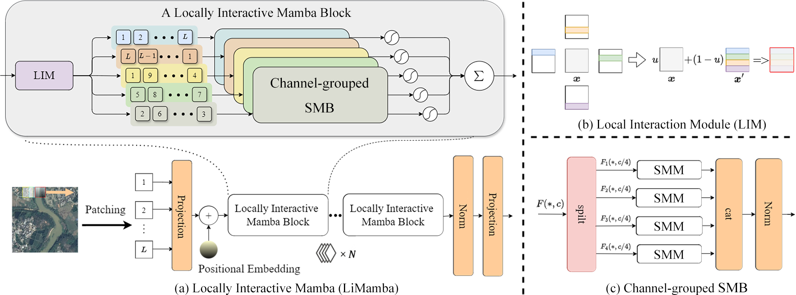

# Locally Interactive Mamba for Remote Sensing Image Classification


## Installation
### Requirements
+ Linux system, Windows is not tested, depending on whether causal-conv1d and mamba-ssm can be installed
+ Python 3.8+, recommended 3.11
+ PyTorch 2.0 or higher, recommended 2.2
+ CUDA 11.7 or higher, recommended 12.1
+ MMCV 2.0 or higher, recommended 2.1

### Environment Installation
+ Step 1: Create a virtual environment named LiMamba and activate it.
```bash
conda create -n LiMamba python=3.11 -y
conda activate LiMamba
```
+ Step 2: Install PyTorch
```bash
conda install pytorch==2.1.2 torchvision==0.16.2 torchaudio==2.1.2 pytorch-cuda=12.1 -c pytorch -c nvidia -y
```
+ Step 3: Install MMCV
```bash
pip install -U openmim
mim install mmcv==2.1.0
# or
pip install mmcv==2.1.0 -f https://download.openmmlab.com/mmcv/dist/cu121/torch2.1/index.html
```
+ Step 4: Install other dependencies.
```bash
pip install -U mat4py ipdb modelindex
pip install transformers==4.39.2
conda install cudatoolkit==11.8 -c nvidia
conda install -c "nvidia/label/cuda-11.8.0" cuda-nvcc
pip install causal-conv1d==1.2.0.post2
pip install mamba-ssm==1.2.0.post1
```

## Remote Sensing Image Classification Dataset
We provide the method of preparing the remote sensing image classification dataset used in the paper.

### UC Merced Dataset
+ Image and annotation download link: [UC Merced Dataset.](http://weegee.vision.ucmerced.edu/datasets/landuse.html)

### AID Dataset
+ Image and annotation download link: [AID Dataset.](https://www.kaggle.com/datasets/jiayuanchengala/aid-scene-classification-datasets)

### NWPU RESISC45 Dataset
+ Image and annotation download link: [NWPU RESISC45 Dataset](https://aistudio.baidu.com/datasetdetail/220767)

## Model Training and Testing
 + Training
```bash
python tools/train.py configs/LiMamba/name_to_config.py  
# name_to_config.py is the configuration file you want to use
```
+ Testing
```bash
python tools/test.py configs/LiMamba/name_to_config.py ${CHECKPOINT_FILE}  
# name_to_config.py is the configuration file you want to use, 
# CHECKPOINT_FILE is the checkpoint file you want to use
```
+ Prediction
```bash
python demo/image_demo.py ${IMAGE_FILE}  configs/LiMamba/name_to_config.py --checkpoint ${CHECKPOINT_FILE} --show-dir ${OUTPUT_DIR}  
# IMAGE_FILE is the image file you want to predict, 
# name_to_config.py is the configuration file you want to use, 
# CHECKPOINT_FILE is the checkpoint file you want to use, 
# OUTPUT_DIR is the output path of the prediction result
```